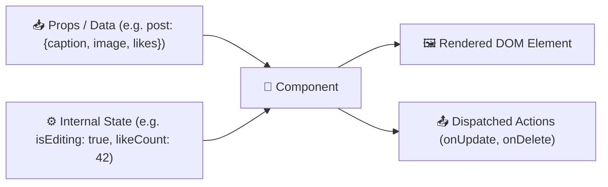
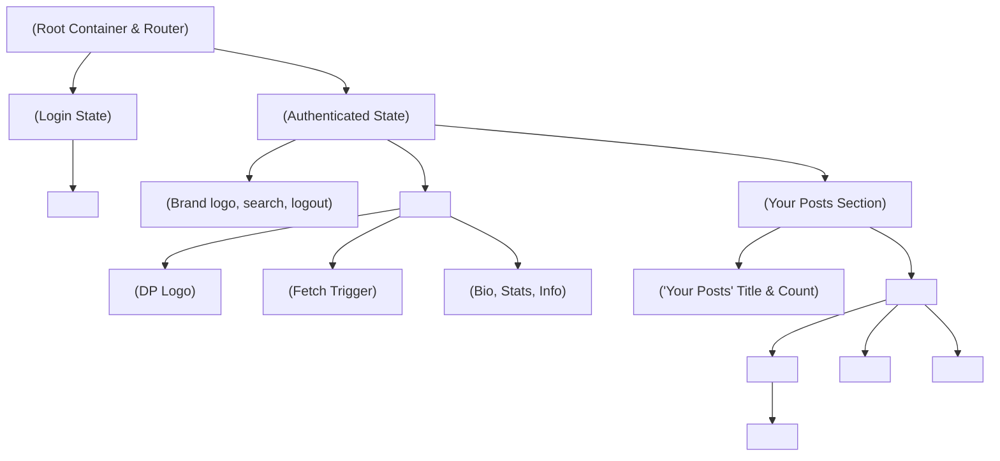

# 🧩 Component-Based UI Architecture Guide

One of the primary goals of this project is to provide a clear, intuitive, and practical guide on **how UI Components work** in modern web development.

---

## 🎯 What is a Component?

A **Component** is an independent, reusable, and self-contained piece of the user interface. Think of it like a LEGO brick:
- It bundles its own **HTML structure** (markup template).
- It bundles its own **CSS styling** (visual presentation).
- It bundles its own **JavaScript logic** (internal state, event listeners, API interactions).
- It accepts **Props (Inputs)** from its parent and can emit **Events (Outputs)**.



---

## 🔍 The Magic of Reusability: Adding Sections by Component Name

When building without components (traditional spaghetti HTML/JS), if you want 3 posts, you have to manually copy-paste 150 lines of duplicate HTML and attach 15 event listeners manually. If one change is needed, you have to edit all 3 copies.

### With Components:
You define the component **once**:
```jsx
// Definition of PostCard component
function PostCard({ post, onUpdateCaption, onDeletePost }) {
    return (
        <article className="post-card">
            <header className="post-header">
                
                <span className="username">{post.author.username}</span>
            </header>
            <div className="post-media">
                
            </div>
            <div className="post-body">
                <p className="caption">{post.caption}</p>
                <div className="post-actions">
                    <button onClick={() => onUpdateCaption(post.id)}>✏️ Edit Caption</button>
                    <button onClick={() => onDeletePost(post.id)}>🗑️ Delete</button>
                </div>
            </div>
        </article>
    );
}
```

Now, whenever you want another identical section on any page, you simply write the component name:

```jsx
<section className="feed-container">
    {/* First Post Section */}
    <PostCard post={post1} onUpdateCaption={handleUpdate} onDeletePost={handleDelete} />

    {/* Second Post Section (Just writing the component name again adds the exact same section!) */}
    <PostCard post={post2} onUpdateCaption={handleUpdate} onDeletePost={handleDelete} />

    {/* Third Post Section */}
    <PostCard post={post3} onUpdateCaption={handleUpdate} onDeletePost={handleDelete} />
</section>
```

Or dynamically across a list:
```jsx
posts.map(item => (
    <PostCard key={item.id} post={item} onUpdateCaption={handleUpdate} onDeletePost={handleDelete} />
))
```

---

## 🏛️ Component Tree Hierarchy in Instagram Demo

Here is how our entire application UI is decomposed into clean, modular components:



---

## 📦 Component Breakdown & Contracts

### 1. `<ProfileAvatar dpUrl={url} size="lg" />`
- **Purpose**: Displays the circular DP profile image with Instagram-style gradient border ring.
- **Props**:
  - `dpUrl` (string): URL to user's profile image.
  - `size` (string): `'sm'`, `'md'`, `'lg'`.

### 2. `<GetProfileButton onClick={fetchProfile} isLoading={loading} />`
- **Purpose**: Renders the action button below the DP that calls `GET http://localhost:8000/api/profile/`.
- **Props**:
  - `onClick` (function): Handler triggering the API call.
  - `isLoading` (boolean): Shows spinner when request is in-flight.

### 3. `<ProfileDetailsCard profile={profileData} />`
- **Purpose**: Renders user bio, stats (followers, following, posts count), email, and join date after backend response.
- **Props**:
  - `profile` (object): Full profile payload from DRF.

### 4. `<PostCard post={post} onUpdate={updateHandler} onDelete={deleteHandler} />`
- **Purpose**: Self-contained card rendering the post image, author info, likes, caption, and controls for updating caption and deleting.
- **Props**:
  - `post` (object): Post object (`id`, `image_url`, `caption`, `likes_count`, `created_at`).
  - `onUpdate` (function): Function invoked when user submits new caption.
  - `onDelete` (function): Function invoked when user confirms post deletion.
- **Internal State**:
  - `isEditing` (boolean): Toggles between caption text view and inline editing input.
  - `currentCaption` (string): Controlled input state for live caption edits.

---

## 💡 Practical Benefits Demonstrated
1. **Encapsulation**: Styles and logic for `<PostCard />` do not leak into `<ProfileDetailsCard />`.
2. **Maintainability**: Changing how captions are edited in `<PostCard />` automatically updates every post in the app without touching other files.
3. **Reusability**: You can drop `<PostCard />` into an Explore feed, a Profile feed, or a Saved posts tab with zero rewrites.
