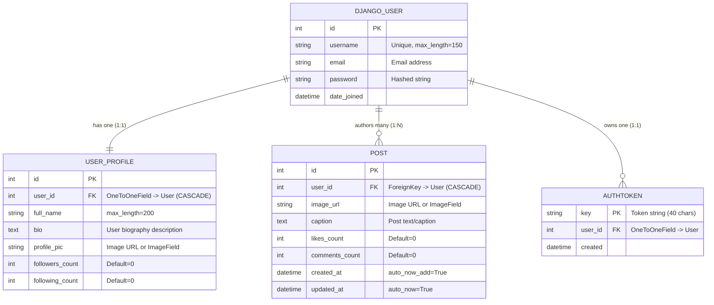

# 🗄️ Database Schema & Django REST Models

This document outlines the data model architecture, relationships, constraints, and DRF Serializers for the Instagram Demo project.

---

## 📊 Entity Relationship (ER) Diagram



---

## 🐍 Django Model Code (`models.py`)

```python
from django.db import models
from django.contrib.auth.models import User

class UserProfile(models.Model):
    user = models.OneToOneField(User, on_delete=models.CASCADE, related_name='profile')
    full_name = models.CharField(max_length=200, blank=True)
    bio = models.TextField(blank=True, default='')
    profile_pic = models.URLField(
        max_length=500, 
        default='https://images.unsplash.com/photo-1534528741775-53994a69daeb?w=400'
    )
    followers_count = models.PositiveIntegerField(default=0)
    following_count = models.PositiveIntegerField(default=0)

    def __str__(self):
        return f"{self.user.username}'s Profile"


class Post(models.Model):
    user = models.ForeignKey(User, on_delete=models.CASCADE, related_name='posts')
    image_url = models.URLField(max_length=500)
    caption = models.TextField(blank=True)
    likes_count = models.PositiveIntegerField(default=0)
    comments_count = models.PositiveIntegerField(default=0)
    created_at = models.DateTimeField(auto_now_add=True)
    updated_at = models.DateTimeField(auto_now=True)

    class Meta:
        ordering = ['-created_at']

    def __str__(self):
        return f"Post #{self.id} by {self.user.username}"
```

---

## 🔄 DRF Serializers (`serializers.py`)

```python
from rest_framework import serializers
from django.contrib.auth.models import User
from .models import UserProfile, Post

class UserAuthorSerializer(serializers.ModelSerializer):
    profile_pic = serializers.CharField(source='profile.profile_pic', read_only=True)

    class Meta:
        model = User
        fields = ['id', 'username', 'profile_pic']


class UserProfileSerializer(serializers.ModelSerializer):
    username = serializers.CharField(source='user.username', read_only=True)
    email = serializers.CharField(source='user.email', read_only=True)
    posts_count = serializers.SerializerMethodField()
    joined_at = serializers.DateTimeField(source='user.date_joined', read_only=True)

    class Meta:
        model = UserProfile
        fields = [
            'id', 'username', 'full_name', 'email', 'bio', 
            'profile_pic', 'posts_count', 'followers_count', 
            'following_count', 'joined_at'
        ]

    def get_posts_count(self, obj):
        return obj.user.posts.count()


class PostSerializer(serializers.ModelSerializer):
    author = UserAuthorSerializer(source='user', read_only=True)

    class Meta:
        model = Post
        fields = [
            'id', 'author', 'image_url', 'caption', 
            'likes_count', 'comments_count', 'created_at', 'updated_at'
        ]
        read_only_fields = ['id', 'author', 'likes_count', 'comments_count', 'created_at', 'updated_at']


class PostCaptionUpdateSerializer(serializers.ModelSerializer):
    class Meta:
        model = Post
        fields = ['caption']
```
