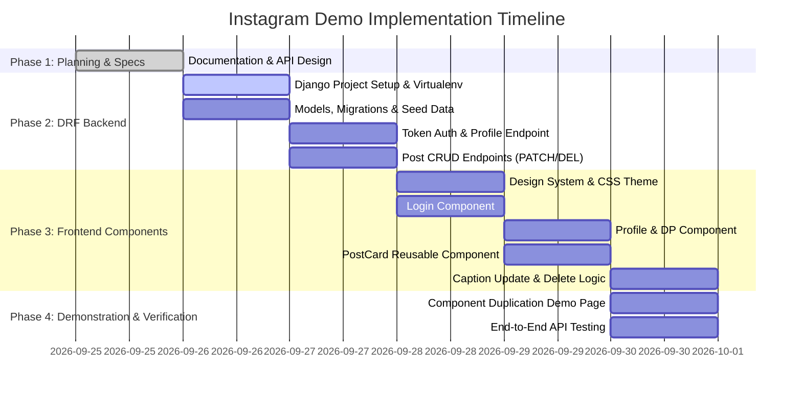

# 🚀 Project Roadmap & Implementation Plan

This document breaks down the end-to-end execution strategy for building the Instagram Demo web application.

---

## 🛠️ Technology Stack

| Layer | Selected Tech | Rationale |
| :--- | :--- | :--- |
| **Backend Framework** | Django 5.x + Django REST Framework | Robust REST architecture, built-in Token Auth, ORM, and serializer validation. |
| **Authentication** | DRF Token Authentication | Simple, standard `Authorization: Token <key>` header support. |
| **Database** | SQLite (or PostgreSQL) | Zero-setup, portable, ideal for demonstration and local development. |
| **Frontend** | Modern Component Architecture (Vanilla ES6 Components / React Vite) | Clean demonstration of UI component reusability without build overhead or with Vite React. |
| **Styling** | Vanilla CSS Design System | Glassmorphism, modern Instagram gradients, sleek dark/light theme, micro-animations. |

---

## 🎯 Implementation Phases

---

## 📋 Detailed Step-by-Step Checklist

### Step 1: DRF Backend Foundation (`backend/`)
1. Create virtual environment and install dependencies:
   - `django`, `djangorestframework`, `django-cors-headers`.
2. Initialize Django project `instagram_backend` and app `api`.
3. Configure `settings.py`:
   - `INSTALLED_APPS` with `'rest_framework'`, `'rest_framework.authtoken'`, `'corsheaders'`, `'api'`.
   - `REST_FRAMEWORK` default authentication: `rest_framework.authentication.TokenAuthentication`.
   - `CORS_ALLOWED_ORIGINS` to allow frontend calls from `localhost`.
4. Create database models: `UserProfile` (1:1 with User) and `Post` (ForeignKey to User).
5. Run migrations (`makemigrations`, `migrate`).
6. Create seed script `seed_demo_data.py` to create a default test user with sample DP and 4 sample posts with captions.

### Step 2: REST Endpoints Implementation
1. **Auth Login**: View to authenticate credentials and return `Token.objects.get_or_create(user=user)`.
2. **Profile View**: `GET /api/profile/` returns serialized `UserProfile` for `request.user`.
3. **Posts ViewSet**:
   - `GET /api/posts/` -> Filter `Post.objects.filter(user=request.user)`.
   - `POST /api/posts/` -> Create post with `user=request.user`.
   - `PATCH /api/posts/{id}/` -> Update post caption with permission check (`post.user == request.user`).
   - `DELETE /api/posts/{id}/` -> Delete post record with permission check.

### Step 3: Frontend Component Development
1. **Design Tokens & Theme**: Curate Instagram-like colors, dark mode gradients, and cards.
2. **Component Structure**:
   - `LoginCard`: Form with username/password fields, calls `/api/auth/login/`, saves token.
   - `ProfileHeader`: Renders circular avatar DP with gradient ring.
   - `GetProfileButton`: Action button triggering `/api/profile/` with `Authorization: Token <key>`.
   - `ProfileDetails`: Card displaying user's name, bio, follower count, and posts count.
   - `PostCard`: Reusable component displaying image, caption, update caption button, and delete button.
3. **Component Duplication Page**: A dedicated visual page demonstrating how calling `<PostCard />` multiple times adds identical sections with isolated state.

### Step 4: Verification & Integration Testing
1. Test login flow and token storage.
2. Test "Get Profile" click and dynamic data rendering.
3. Test "Your Posts" rendering.
4. Test caption update: edit caption -> PATCH request -> instant UI update.
5. Test delete post: click delete -> DELETE request -> post card disappears with animation.
