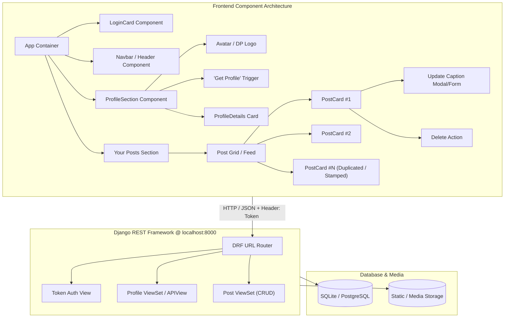
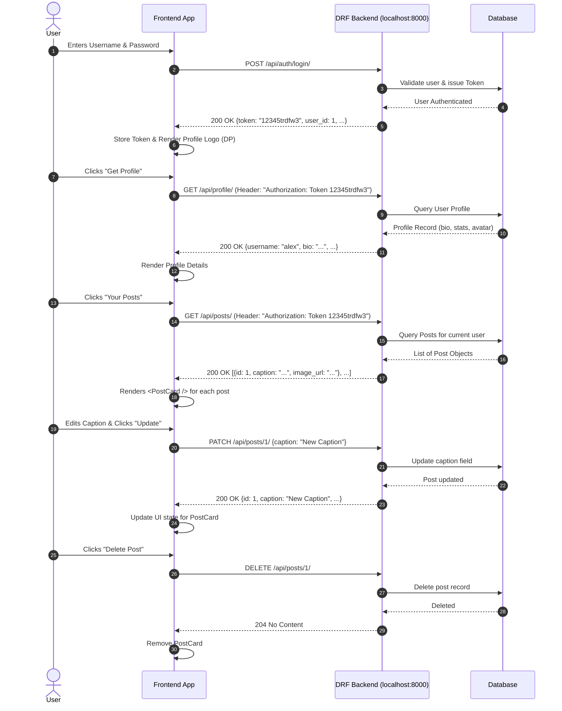

# 📸 Instagram Demo — Project Documentation & Architectural Blueprint

Welcome to the **Instagram Demo Project**! This project is designed as both a fully functional mini-Instagram web application and an educational reference to master:
1. **Component-Based UI Architecture**: How encapsulated components (such as `<PostCard />` and `<ProfileHeader />`) allow you to reuse and stamp out UI sections simply by invoking the component name.
2. **Django REST Framework (DRF) Backend Architecture**: RESTful conventions, Token Authentication with `Authorization: Token <token_key>`, serializers, and CRUD viewsets (Create, Read, Update Caption, Delete).

---

## 📚 Documentation Index

Click on the links below to explore each detailed specification document:

| Document | Key Focus Area |
| :--- | :--- |
| 📘 [**Component Architecture Guide**](./COMPONENT_ARCHITECTURE.md) | Component theory, UI breakdown, Props/State data flow, and code examples demonstrating section duplication. |
| 🔌 [**API Specification**](./API_SPECIFICATION.md) | Full endpoint contracts for `http://localhost:8000`, headers, request/response JSON schemas, error codes, and curl commands. |
| 🗄️ [**Database Schema & DRF Models**](./DATABASE_SCHEMA.md) | Relational design (User, Profile, Post), DRF Serializers, and migration specifications. |
| 🚀 [**Project Roadmap & Execution Plan**](./PROJECT_ROADMAP.md) | Step-by-step implementation milestones for backend, frontend, and verification. |

---

## 🏗️ High-Level System Architecture

---

## ⚡ Core User Journey & Interaction Flow

---

## 🔑 Key Conventions
- **Base API URL**: `http://localhost:8000`
- **Authentication Scheme**: DRF Token Authentication (`Authorization: Token <token_key>`). Note: Explicitly standard DRF `Token` prefix, **NOT** `Bearer`.
- **Data Interchange**: `application/json` for all request & response payloads.
